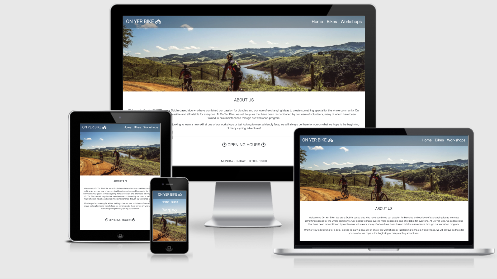
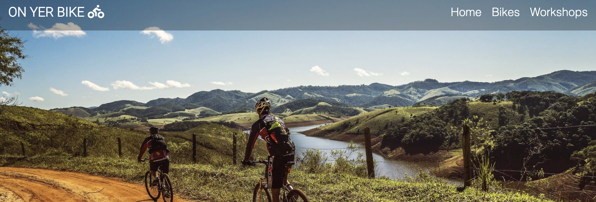
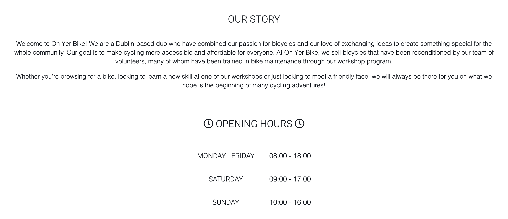
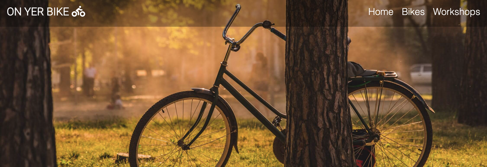
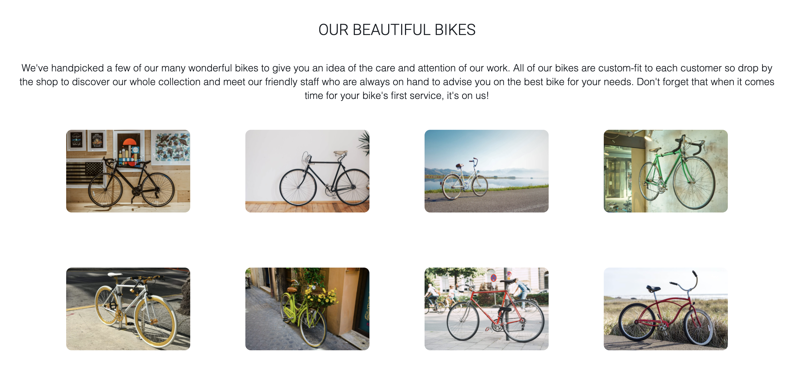
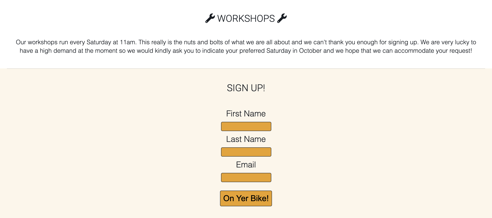
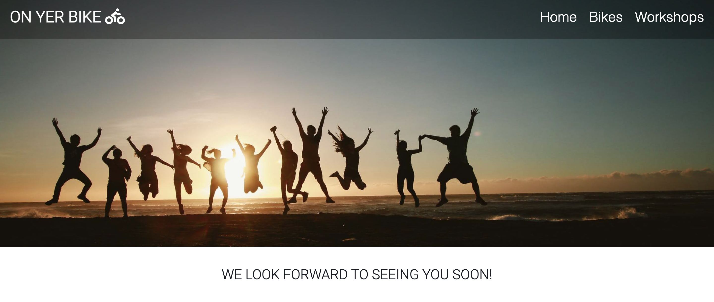

# On Yer Bike
 

On Yer Bike is a Dublin-based bicycle website that aims to make cycling more accessible and affordable to everyone. It offers reconditioned bikes as well as workshops for bike maintenance. This is an opportunity for users to both learn a new skill and be a part of the local community. This website is a friendly environment that caters to cyclists of all levels. On Yer Bike will allow users to view bikes from our range of models and sign up to maintenance workshops.

## Features
 

### Navigation bar and Home background image

The navigation bar links to the Home, Bikes, Workshops and Thank You pages included in this project and is present on each page to allows for easy navigation.

Coupled with the title of the website, the Home background image immediately indicates to users that the website is bike-oriented and sparks their curiosity as to the content of this website.

 
 

### About Us Section

This section introduces the users to the company concept and gives information about what this website hopes to achieve as well as encouraging them to check out the other pages which feature bikes and a workshop sign up form.

### Opening Hours

This section is a table feature that clearly indicates the opening hours of the shop so that users can plan their trip to the shop and have plenty of time to browse the bikes without being left short of time.

 
 

### Social Media

The footer section of this website is reserved for social media links so that users can stay engaged with the shop across multiple platforms.

All links open in separate tabs and are featured on the footer of every page for consistency.

 
 

### Bikes Background Image

The header of the bike page features an attractive bike scene that distinguishes this page from the home page while keeping the same design and consistency of the navigation bar and logo for an optimal user experience.

 
 

### Bikes Section

This section features a selection of the many bikes available at On Yer Bike so that users have an idea of what products and services we can offer them.

This section also encourages users to drop by the shop for their custom-fit bicycle where they can engage with staff and get to know people in the local community.

 
 

### Workshop Section

This section allows users to sign up to workshops so they can begin their journey into learning bike maintenance.

All form fields are required for form validation.

 
 

### Thank You Page

A nice feature of the form validation is that it takes the users to a thank you page.

This further solidifies a positive user experience on this website and will reassure users that this is a trustworthy and caring website.

 
 

### Features Left to Implement

Add a timetable and reservation system so users can choose workshop times most suited to them and that we can organise our staff to meet the needs of attendees.
 

## Testing
 

### Technologies

HTML5, CSS3
 

### Validator Testing

HTML: No errors were returned when passing through the official W3C validator.

CSS: No errors were returned when passing through the official (Jigsaw) validator.

### Google Lighthouse Testing

All pages passed through Lighthouse testing for mobile and desktop with near perfect scores in Accessibility, SEO, Best Practices and Performance.

Using Google Lighthouse helped me improve my scores by checking their warnings and addressing them to achieve a higher score.

### Responsivity

This website has a responsive logo and navigation bar that centre for screens of 650px and lower.

The Workshop background image has a media query to align the image for screens of 475px and lower.

The other images, text, forms and tables are responsive without using media queries.

I have tested all pages of this project using Google Devtools to ensure that it meets the responsivity requirements for both desktop devices and mobile devices with screen widths as low as 360px

### Feature Function

All features have been thoroughly tested using my published Github Pages link to ensure that the functionally of my site is not limited to my local Gitpod server. The Home, Bikes, and Workshops links in the navigation bar go to their intended page as does the logo which is linked to the Home page.

The form validates to my Thank You page as intended and all fields are required before validation can occur.

### Cross Browser Testing

## Deployment
 
The site was deployed to Github Pages through the following steps:

In the Github repository, select the Main (Master) branch in the settings tab

Having selected the Main (Master) branch, the project will be deployed and will be active in the Github pages section.

The live link can be found here - https://tymaestro.github.io/On-Yer-Bike/

## Credits
 

Font icons were used throughout the website and have been taken from [Font Awesome](https://fontawesome.com/).

All images(except project screenshots) come from [Pexels](https://www.pexels.com/) and image compression used [TinyPNG](https://tinypng.com/).

Fonts used were Open-Sans and Roboto and were taken from [Google Fonts](https://fonts.google.com/).

Use of Flex taken from completion of [Flexbox Froggy](https://flexboxfroggy.com/) game.

Asterisk wild card selector in CSS learned from Love Running project walkthrough.

README layout taken from Love Running project walkthrough.
 
 

### Text

All text is original content

## Acknowledgements

My mentor for helpful feedback during mentor sessions